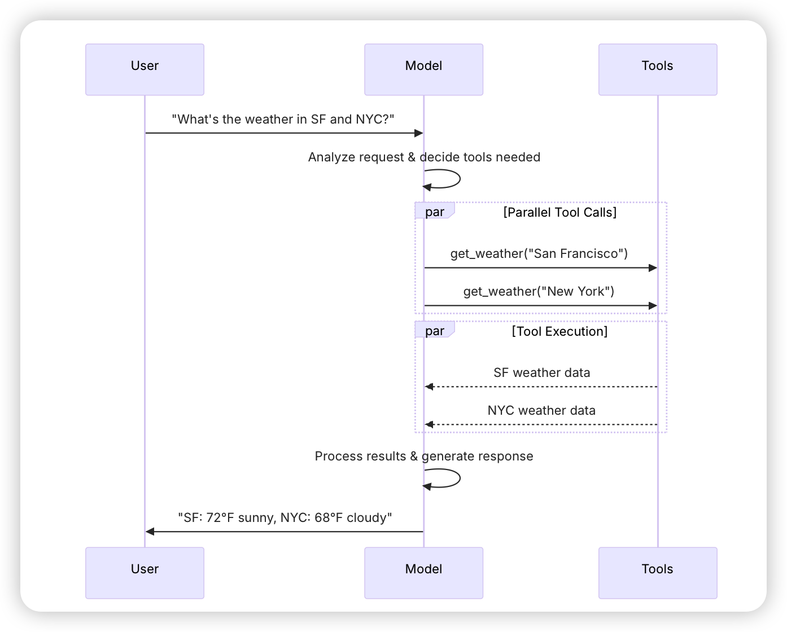

# Day 2 Notes — LangChain Primer

## Key Concepts Learned

### LangChain Core Concepts

**What is LangChain?**

LangChain is a framework for building LLM-powered applications using reusable tools, libraries, and patterns. Similar to frontend frameworks (for example, React), LangChain provides standardized building blocks to speed development and reduce boilerplate.

It abstracts common LLM application concerns so you can focus on application logic instead of orchestration details.

**Core Abstractions in LangChain**

1. **Agents**

	- Orchestrators that combine a language model (reasoning engine) and a set of tools for taking actions.
	- Agents run via the ReAct loop: reason → act (tool call) → observe → reason again.
	- Ideal for multi-step, tool-using, goal-directed applications.

2. **Models (LLMs / Chat Models)**

	- The reasoning engine of your agent or LLM application.
	- LangChain provides a unified interface across providers (for example, `openai`, `anthropic`).
	- Configuration includes model choice (e.g. `gpt-5`, `anthropic:claude-3`), `temperature`, `max_tokens`, timeouts, and more.
	- Modes:
	  - **Static model** — fixed throughout execution.
	  - **Dynamic model** — selected at runtime using middleware.

3. **Messages**

	- Fundamental unit of context used as input and output for models.
	- Each message typically contains: `role` (system, user, assistant, tool), `content`, and optional `metadata`.
	- Agents maintain a sequence of messages as their evolving state.

4. **Tools**

	- Abstraction for actions the agent can perform (wraps a callable function and input schema).
	- Supports sequential or parallel tool calls, dynamic tool selection, and retries/error handling.
	- Examples: search APIs, weather APIs, DB queries, code execution.

5. **Short-Term Memory**

	- Stores information within a single conversation or agent run (message history, preferences, intermediate results).
	- Usually managed via middleware or custom state schemas.

6. **Streaming**

	- Allows progressive output while the model is still generating (improves perceived latency and user experience for long operations).

7. **Structured Output**

	- Enforces predictable response formats (e.g., JSON or typed schemas).
	- Strategies:
	  - **ToolStrategy** — uses artificial tool calls (model-agnostic).
	  - **ProviderStrategy** — uses provider-native structured-output features (for example, OpenAI structured outputs).

### Flow Diagram: Prompt → Model → Tools

*Image source: https://docs.langchain.com/oss/python/langchain/models*

## Knowledge Check Questions

1. **What problem does LangChain solve as a framework?**

Answer: LangChain provides standardized abstractions (models, tools, messages, agents, memory, streaming) that simplify building complex LLM-powered applications. It handles orchestration so developers can focus on business logic rather than low-level LLM calls.

2. **What is an Agent in LangChain, and why do we need one?**

Answer: An Agent is an orchestrator that uses a model + tools to iteratively reason and act. It's needed when your application requires:

- multi-step reasoning
- tool usage
- decision-making based on intermediate results

3. **What is the ReAct loop, and how does an Agent use it?**

Answer: The ReAct loop = Reason → Act → Observe → Reason (repeat). An agent:

- reasons using the model
- calls tools
- receives observations
- decides the next step

This continues until the final answer is produced.

4. **What role do Models play in an Agent?**

Answer: Models (LLMs or chat models) are the reasoning engine. They determine:

- quality of reasoning
- reliability
- latency
- cost

LangChain provides a unified interface so the same agent can work across different providers.

5. **What is the difference between a static model and a dynamic model?**

Answer:

- **Static model** — chosen once at agent creation; does not change.
- **Dynamic model** — selected at runtime using middleware based on context, state, or conversation length.

6. **What are Messages in LangChain? Why are they important?**

Answer: Messages are the fundamental unit of context (role + content + metadata). They keep track of:

- conversation history
- tool results
- model responses

Agents operate over a sequence of messages as their internal state.

7. **How do Tools extend an Agent’s capability beyond text generation?**

Answer: Tools allow the agent to perform actions in the real world — like calling APIs, searching, running code, or querying a database. Each tool wraps:

- a function
- an input schema

Agents decide dynamically which tools to call.

8. **What is Short-Term Memory in the context of LangChain?**

Answer: Short-term memory stores state within a single agent run, such as:

- conversation history
- user preferences
- intermediate tool results

It ensures continuity and coherence throughout multi-step reasoning.

9. **What is Streaming and why is it useful?**

Answer: Streaming allows partial output to be returned before the final response is ready. Useful for:

- long or complex reasoning
- multi-step agents
- improving perceived speed and user experience

10. **What is Structured Output?**

Answer: Structured output enforces a specific output format (like JSON or a typed schema). This ensures the LLM produces machine-readable, predictable responses — critical when the output feeds into downstream systems.

11. **What strategies does LangChain provide for Structured Output?**

Answer:

- **ToolStrategy:** uses artificial tool calls; works with any model.
- **ProviderStrategy:** uses the model provider’s native structured output; more reliable but provider-specific.

12. **Which LangChain component is most central to orchestrating all others?**

Answer: Agents — they coordinate models, tools, messages, memory, structured output, and streaming.