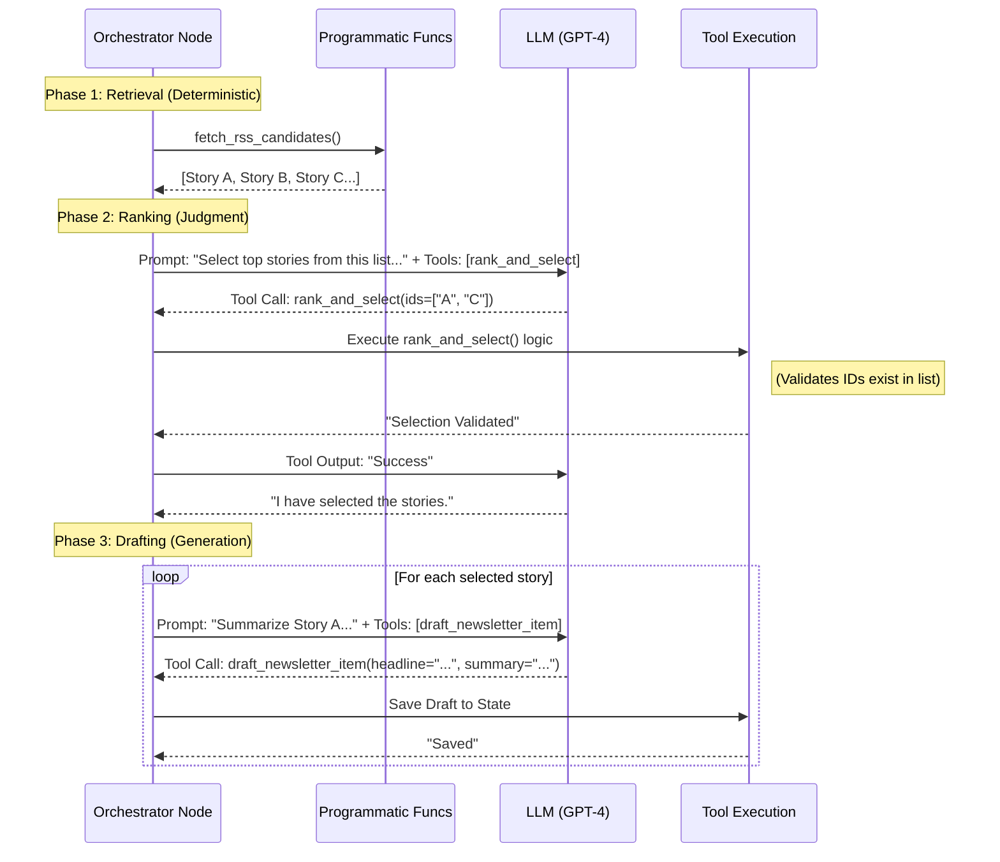

# Day 9 Notes: Function Calling & Tools

## 1. Summary of Core Concepts
Based on the [OpenAI Function Calling Guide](https://platform.openai.com/docs/guides/function-calling) and [LangChain Tools Documentation](https://docs.langchain.com/oss/python/langchain/tools), here are the shared fundamental concepts:

### A. The "Tool Calling" Lifecycle
Both frameworks emphasize that **the model does not execute code**. It is a multi-step conversation:
1.  **Definition**: You provide the model with a list of tools (names + schemas).
2.  **Decision**: The model decides *if* and *which* tool to call based on the conversation context.
3.  **Generation**: The model generates a structured "tool call" (JSON arguments).
4.  **Execution**: Your application (the "Node") executes the actual logic (API call, DB query).
5.  **Feedback**: You pass the tool's output back to the model.
6.  **Response**: The model uses that output to generate the final natural language response.

### B. Schema Definition
*   **OpenAI**: Uses raw **JSON Schema** to define parameters. It supports `strict: true` to guarantee the model's output matches the schema exactly.
*   **LangChain**: Uses Python type hints and **Pydantic models** to automatically generate that JSON Schema. The `@tool` decorator is the primary abstraction.

### C. Separation of Concerns
*   **Functions/Tools**: The specific unit of work (e.g., `rank_candidates`).
*   **Runtime/Context**: The environment where the tool runs. LangChain uses `ToolRuntime` to inject user IDs or DB connections so the LLM doesn't need to hallucinate them.

---

## 2. Two Kinds of "Function Calls"
It is crucial to distinguish between standard code execution and LLM-driven tool use.

### A. Programmatic Function Calls
*   **Definition**: Normal Python functions written and called by the developer (e.g., `fetch_rss_candidates()`).
*   **Decider**: The Developer (hardcoded in the workflow).
*   **Properties**: Deterministic, cheap (no tokens), fully testable, safe.
*   **Role**: Doing the actual heavy lifting (fetching data, saving to DB).

### B. LLM Function (Tool) Calls
*   **Definition**: Structured JSON outputs generated by the model (e.g., `rank_and_select`).
*   **Decider**: The LLM (based on context and schema).
*   **Properties**: Judgment-heavy, probabilistic, requires validation, costs tokens.
*   **Role**: Making decisions or structuring unstructured data.

### C. The "Node" Concept
A **Node** is the orchestration boundary that manages both. It calls programmatic functions to get data, then might call the LLM to process it. LLM tool calls should live *inside* nodes, not replace them.

---

## 3. Newsletter Agent Implementation

We will apply these concepts to the **Newsletter Agent**, specifically for the **Ranking** and **Drafting** phases.

### A. Defining the Tools

#### 1. `rank_and_select` (OpenAI Schema Style)
This tool allows the model to select the best stories from a raw list.

```json
{
  "type": "function",
  "name": "rank_and_select",
  "description": "Select the top 3-5 most relevant stories for the AI newsletter from the provided list of candidates.",
  "strict": true,
  "parameters": {
    "type": "object",
    "properties": {
      "selected_ids": {
        "type": "array",
        "items": { "type": "string" },
        "description": "The list of unique IDs for the selected stories."
      },
      "selection_reasoning": {
        "type": "string",
        "description": "A brief summary explaining the editorial choice for this selection."
      }
    },
    "required": ["selected_ids", "selection_reasoning"],
    "additionalProperties": false
  }
}
```

#### 2. `draft_newsletter_item` (LangChain `@tool` Style)
This tool allows the model to write the final summary for a selected story.

```python
from langchain_core.tools import tool
from pydantic import BaseModel, Field

class DraftInput(BaseModel):
    story_id: str = Field(description="The unique ID of the story being summarized.")
    headline: str = Field(description="A punchy, engaging headline for the newsletter item.")
    summary_markdown: str = Field(description="The 2-3 sentence summary in Markdown format.")
    tags: list[str] = Field(description="List of 2-3 topic tags (e.g., 'LLMs', 'Robotics').")

@tool(args_schema=DraftInput)
def draft_newsletter_item(story_id: str, headline: str, summary_markdown: str, tags: list[str]):
    """
    Format and save a drafted newsletter item.
    """
    # In a real agent, this might save to a database or state object
    return f"Draft saved for story {story_id}: {headline}"
```

---

## 4. Execution Flow (Newsletter Agent)

This diagram demonstrates how the **Node** (Orchestrator) interacts with **Programmatic Functions** vs. **LLM Tools**.



### Key Distinction: Nodes vs. Functions
*   **Nodes** (e.g., `RankingNode`) control the flow. They call `fetch_rss_candidates` (Programmatic) directly.
*   **LLM Tools** (e.g., `rank_and_select`) are only invoked when the Node asks the LLM for a decision. The Node *must* validate the LLM's output (e.g., checking if the selected IDs actually exist).

---

## 5. Security & Reliability Plan

### A. Tool Choice Strategy
For the **Ranking Node**, we don't want the model to chat; we want it to rank.
*   **Configuration**: Set `tool_choice={"type": "function", "function": {"name": "rank_and_select"}}`.
*   **Effect**: The model *must* call this tool, preventing it from returning unstructured text like "Here are the stories I liked...".

### B. Safety Guardrails
1.  **Read-Only Tools**: The `rank_and_select` tool doesn't modify the database; it just returns a selection. This is safe.
2.  **Validation**: The `draft_newsletter_item` tool accepts a `story_id`. The application code must verify that `story_id` belongs to a valid, currently-processing story to prevent "ID hallucination" or cross-user data leaks.
3.  **Strict Mode**: Enabling `strict: true` in the schema ensures the model never returns a `headline` as a number or forgets the `tags` array, reducing runtime errors in the drafting pipeline.
