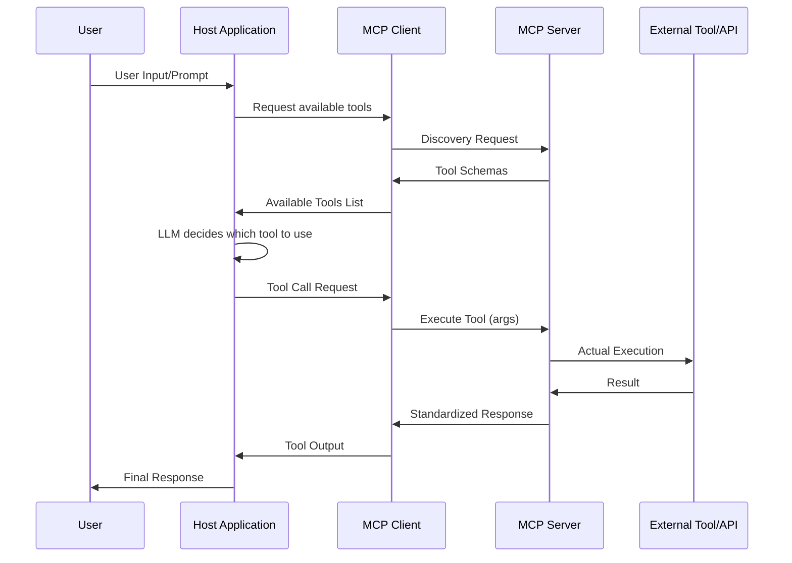

# Day 10 Notes: MCP & Function Calling

## 1. Summary of Core Concepts

### A. What is MCP (Model Context Protocol)?

**Model Context Protocol (MCP)** is an **open, standardized protocol** that enables AI applications to securely connect with external data sources and tools through a unified interface. Think of it as a "universal adapter" for AI systems.

#### Key Characteristics:
- **Open Protocol**: Not tied to any specific vendor or model
- **Client-Server Architecture**: Clear separation between AI application (client) and tool providers (server)
- **Standardized Interface**: Consistent way to discover, describe, and invoke tools
- **Transport Agnostic**: Works over STDIO, HTTP, SSE, or other communication channels
- **Designed for Scale**: Built for production systems with multiple tools and services

#### MCP Core Components:

1. **MCP Client**
   - Embedded in the AI application (agent, IDE, chatbot)
   - Discovers available tools from servers
   - Sends standardized requests
   - Handles responses and errors

2. **MCP Server**
   - Exposes tools/resources in a standardized format
   - Provides tool schemas and metadata
   - Executes tool logic
   - Returns structured results

3. **Transport Layer**
   - STDIO (standard input/output)
   - HTTP/SSE (Server-Sent Events)
   - WebSocket (future support)

---

## 2. Function Calling vs. MCP: A Comparison

### A. Function Calling (Traditional Approach)

**Definition**: A model capability where the LLM generates structured JSON to invoke a specific function defined in the application code.

**Workflow**:
```
User Prompt → LLM → Function Call JSON → App Code → Tool Execution → Result → LLM → Response
```

**Characteristics**:
- ✅ **Simple Setup**: Direct integration in application code
- ✅ **Low Latency**: No additional abstraction layers
- ✅ **Full Control**: Developer controls everything
- ❌ **Tight Coupling**: Tools hardcoded in each application
- ❌ **No Reusability**: Can't share tools across apps or models
- ❌ **Limited Scalability**: Difficult to manage 10+ tools

**Best For**:
- MVPs and prototypes
- Single-app systems
- 1-5 simple tools
- Quick experiments

### B. MCP (Standardized Approach)

**Definition**: An open protocol that standardizes how AI applications discover and interact with external tools through a client-server architecture.

**Workflow**:
```
User Prompt → Host App → MCP Client → MCP Server → Tool Discovery → Tool Execution → 
Result → MCP Client → LLM → Response
```

**Characteristics**:
- ✅ **Decoupled Architecture**: Tools separate from application logic
- ✅ **Reusability**: Same MCP server works with multiple apps/models
- ✅ **Scalability**: Easy to add/remove tools without code changes
- ✅ **Standardization**: Consistent interface across all tools
- ❌ **Setup Complexity**: Requires server infrastructure
- ❌ **Additional Latency**: Extra network/IPC layer

**Best For**:
- Production systems
- Enterprise applications
- Multi-tool environments (10+ tools)
- Cross-app tool sharing

---

## 3. MCP Architecture Deep Dive

### A. Three-Layer Architecture

```
┌─────────────────────────────────────────────────┐
│          Host Application Layer                 │
│  (Claude Desktop, IDEs, Custom Agents)          │
└────────────────┬────────────────────────────────┘
                 │
┌────────────────▼────────────────────────────────┐
│           MCP Client Layer                      │
│  • Tool Discovery                               │
│  • Request Formatting                           │
│  • Response Handling                            │
│  • Transport Management                         │
└────────────────┬────────────────────────────────┘
                 │
          ┌──────┴──────┐
          │  Transport  │
          │  (STDIO/HTTP)│
          └──────┬──────┘
                 │
┌────────────────▼────────────────────────────────┐
│           MCP Server Layer                      │
│  • Tool Registration                            │
│  • Schema Definition                            │
│  • Tool Execution                               │
│  • Resource Management                          │
└─────────────────────────────────────────────────┘
```

### B. MCP Communication Flow



### C. Key MCP Concepts

1. **Tool Discovery**
   - Servers advertise available tools on connection
   - Clients query server capabilities dynamically
   - No hardcoded tool lists in client code

2. **Standardized Schemas**
   - JSON Schema for tool inputs/outputs
   - Consistent error handling
   - Version negotiation

3. **Resources vs Tools**
   - **Resources**: Data sources (files, databases)
   - **Tools**: Actions/operations (search, calculate)
   - **Prompts**: Reusable prompt templates

4. **Transport Abstraction**
   - STDIO: For local processes
   - HTTP/SSE: For remote services
   - Easy to swap without changing logic

---

## 4. When to Use What?

### Decision Matrix

| Scenario | Function Calling | MCP |
|----------|-----------------|-----|
| **Number of Tools** | 1-5 tools | 10+ tools |
| **Deployment** | Single app | Multi-app ecosystem |
| **Development Stage** | MVP/Prototype | Production |
| **Tool Reuse** | No sharing needed | Share across apps |
| **Team Size** | 1-2 developers | 3+ teams |
| **Tool Updates** | Rare | Frequent |
| **Latency Sensitivity** | <100ms critical | Can tolerate 200-500ms |
| **Security Requirements** | Simple | Complex (multiple vendors) |

### Hybrid Approach

In practice, you can combine both:

1. **Simple, Core Tools**: Use direct function calling
   - Get current time
   - Format text
   - Basic calculations

2. **Complex, External Tools**: Use MCP
   - Database queries
   - API integrations
   - Third-party services

---
## 5. Practical Comparison Example

### Scenario: Get weather and send email

#### Function Calling Approach

```python
# Define tools in application code
tools = [
    {
        "type": "function",
        "function": {
            "name": "get_weather",
            "description": "Get weather for a location",
            "parameters": {
                "type": "object",
                "properties": {
                    "location": {"type": "string"}
                },
                "required": ["location"]
            }
        }
    },
    {
        "type": "function",
        "function": {
            "name": "send_email",
            "description": "Send an email",
            "parameters": {
                "type": "object",
                "properties": {
                    "to": {"type": "string"},
                    "subject": {"type": "string"},
                    "body": {"type": "string"}
                },
                "required": ["to", "subject", "body"]
            }
        }
    }
]

# Application logic tightly coupled
response = client.chat.completions.create(
    model="gpt-4",
    messages=[{"role": "user", "content": "What's the weather in Paris?"}],
    tools=tools
)

# Execute function based on model's choice
if response.choices[0].message.tool_calls:
    tool_call = response.choices[0].message.tool_calls[0]
    if tool_call.function.name == "get_weather":
        result = get_weather_impl(tool_call.function.arguments)
```

#### MCP Approach

```python
# Application code - no tool definitions needed
async with mcp_client_session() as session:
    # Tools discovered automatically
    tools = await session.list_tools()
    
    # LLM gets tool list
    response = await llm.chat(
        messages=[{"role": "user", "content": "What's the weather in Paris?"}],
        tools=tools  # Dynamically discovered
    )
    
    # Execute via MCP
    if response.tool_calls:
        tool_call = response.tool_calls[0]
        result = await session.call_tool(
            tool_call.name,
            tool_call.arguments
        )
```

**Key Difference**: In MCP, adding a new tool (e.g., "book_flight") only requires deploying a new MCP server. No client code changes needed!

---
## 6. MCP Implementation Example (Embedded Mini-MCP)

> This section reflects the **embedded mini-MCP implementation** used in the newsletter agent.  
> Instead of running a standalone MCP server, MCP concepts are embedded directly in the backend via a lightweight `mcp_like` infrastructure, preserving MCP’s architectural benefits while avoiding extra operational overhead.

### A. Embedded MCP-like Architecture

**Core idea**

- LangGraph nodes never call external APIs directly
- All external integrations are accessed through a **standardized tool executor**
- Tools are registered once and invoked by name with validated inputs

```
LangGraph Node
   ↓ invoke_tool(name, payload)
Mini-MCP Executor
   ↓ registry lookup + schema validation
Tool Adapter (RSS / Web / NYT / X)
   ↓ connector + policy enforcement
External Service
```

This design provides:
- Tool standardization
- Clear separation of concerns
- Structured outputs and error handling

without deploying a standalone MCP server.

---

### B. Tool Registry & Executor

At application startup, all tools are registered:

```python
from newsletter_agent.mcp_like import register_all_tools

register_all_tools()
```

Each tool is registered with:
- tool name
- handler function
- input/output JSON schemas
- description metadata

All tools are invoked through a single executor:

```python
from newsletter_agent.mcp_like import invoke_tool

result = invoke_tool(
    "fetch_rss_items",
    {
        "feed_url": "https://example.com/rss",
        "max_items": 25
    }
)
```

The executor centrally handles:
- input validation
- exception → structured error conversion
- execution timing and metadata
- output schema validation

---

### C. Standardized Tool Result Shape

All tools return the same `ToolResult` structure:

```python
ToolResult(
  items=[
    ToolItem(
      title="...",
      url="https://...",
      published_at="2025-12-17T20:10:00Z",
      snippet="...",
      source="rss:https://example.com/rss",
      raw_id="abc123"
    )
  ],
  meta={"tool": "fetch_rss_items", "latency_ms": 132},
  warnings=[...],
  errors=[...]
)
```

**Guarantees**
- All URLs are validated and canonicalized
- Tools never throw raw exceptions to the graph
- Partial success is supported (items + errors)

---

### D. Tool Adapters Implemented

The embedded MCP-like layer includes five adapters:

- `fetch_rss_items`
- `search_web_fresh`
- `search_web_custom_domains`
- `fetch_nyt_items`
- `fetch_x_items`

Each adapter:
- enforces SSRF protection and domain policies
- normalizes provider-specific responses
- emits structured warnings for non-fatal issues

---

### E. LangGraph Integration Pattern

LangGraph nodes interact with tools indirectly:

```python
result = invoke_tool("search_web_fresh", {"query": topics})

if result.items:
    state.candidates.extend(result.items)
    for item in result.items:
        state.provenance[item.url] = result.meta["tool"]

if result.errors:
    state.tool_errors.extend(result.errors)
```

**Key boundaries**
- Tools never mutate graph state
- Nodes own merging, deduplication, and ranking
- Write nodes only reference URLs present in `state.selected`

---

## 7. Best Practices

### A. When Building with Function Calling
1. **Keep it Simple**: Limit to 3-5 well-defined tools
2. **Strong Validation**: Validate all LLM-generated arguments
3. **Error Handling**: Gracefully handle malformed tool calls
4. **Clear Descriptions**: Write detailed tool/parameter descriptions
5. **Test Extensively**: LLM behavior is probabilistic

### B. When Building with MCP
1. **Design for Reuse**: Make servers generic and configurable
2. **Version Your APIs**: Use semantic versioning for tool schemas
3. **Implement Health Checks**: Monitor server availability
4. **Security First**: Authenticate clients, validate inputs
5. **Document Thoroughly**: Provide clear server documentation
6. **Use Transports Wisely**: STDIO for local, HTTP for remote
7. **Error Messages**: Return helpful, actionable error messages

### C. Choosing the Right Approach
1. **Start Simple**: Begin with function calling for MVPs
2. **Plan for Growth**: If you anticipate 10+ tools, start with MCP
3. **Evaluate Latency**: Measure if the MCP overhead is acceptable
4. **Consider Maintenance**: MCP reduces long-term maintenance burden
5. **Team Structure**: MCP enables better separation of concerns

---

## 8. Workflow Diagrams

### A. Function Calling Workflow

```
┌──────────┐
│   User   │
└────┬─────┘
     │ "What's the weather in Paris?"
     ▼
┌─────────────────┐
│ Application     │
│ (with hardcoded │
│  tool defs)     │
└────┬────────────┘
     │ 1. Send prompt + tool schemas
     ▼
┌─────────────────┐
│      LLM        │
│  (GPT-4, etc)   │
└────┬────────────┘
     │ 2. Returns tool call JSON
     │    {"name": "get_weather",
     │     "args": {"location": "Paris"}}
     ▼
┌─────────────────┐
│  Application    │
│  Code           │
└────┬────────────┘
     │ 3. Parse JSON & execute
     ▼
┌─────────────────┐
│ get_weather()   │
│ function        │
└────┬────────────┘
     │ 4. Return result
     ▼
┌─────────────────┐
│      LLM        │
└────┬────────────┘
     │ 5. Generate final response
     ▼
┌──────────┐
│   User   │
└──────────┘
```

### B. MCP Workflow

```
┌──────────┐
│   User   │
└────┬─────┘
     │ "What's the weather in Paris?"
     ▼
┌─────────────────┐
│ Host App        │
│ (Generic MCP    │
│  client)        │
└────┬────────────┘
     │ 1. Request available tools
     ▼
┌─────────────────┐
│  MCP Client     │
└────┬────────────┘
     │ 2. Discovery request
     ▼
┌─────────────────┐
│  MCP Server     │
│  (Weather)      │
└────┬────────────┘
     │ 3. Return tool schemas
     ▼
┌─────────────────┐
│  MCP Client     │
└────┬────────────┘
     │ 4. Tools list
     ▼
┌─────────────────┐
│ Host App + LLM  │
└────┬────────────┘
     │ 5. Decide: call "get_weather"
     ▼
┌─────────────────┐
│  MCP Client     │
└────┬────────────┘
     │ 6. Tool execution request
     ▼
┌─────────────────┐
│  MCP Server     │
└────┬────────────┘
     │ 7. Execute tool
     ▼
┌─────────────────┐
│ External API    │
│ (Weather API)   │
└────┬────────────┘
     │ 8. Return data
     ▼
┌─────────────────┐
│  MCP Server     │
└────┬────────────┘
     │ 9. Standardized response
     ▼
┌─────────────────┐
│  MCP Client     │
└────┬────────────┘
     │ 10. Result
     ▼
┌─────────────────┐
│ Host App + LLM  │
└────┬────────────┘
     │ 11. Generate response
     ▼
┌──────────┐
│   User   │
└──────────┘
```

---

## 9. Key Takeaways

1. **Function Calling** is a model capability; **MCP** is an infrastructure protocol
2. They are **complementary**, not competitive
3. **Function Calling** provides the *intent*; **MCP** provides the *execution framework*
4. Start with Function Calling, migrate to MCP as you scale
5. MCP enables **tool reusability** across apps, models, and teams
6. MCP's client-server architecture enables **better security and isolation**
7. The overhead of MCP is justified when you have **10+ tools** or **multiple applications**

---

## 10. Knowledge Check

✅ **What problem does MCP solve beyond function calling?**
- Tool discovery and standardization across applications
- Decoupling tool implementation from application logic
- Reusability of tools across different AI models and apps
- Scalability for systems with many tools

✅ **When is direct function calling sufficient?**
- MVPs and prototypes
- Single application with 1-5 simple tools
- When latency is critical (<100ms)
- When tool definitions rarely change

✅ **When does MCP become necessary?**
- 10+ tools in your system
- Multiple applications sharing the same tools
- Frequent tool updates/additions
- Enterprise environments with multiple teams
- Need for strong security isolation

✅ **How do Function Calling and MCP work together?**
- Function calling generates the tool call intent (what to do)
- MCP provides the infrastructure to discover and execute tools (how to do it)
- LLM uses function calling to decide; MCP executes the decision

---

## 11. Next Steps

1. **Experiment with Function Calling**: Build a simple agent with 2-3 tools
2. **Set up an MCP Server**: Create a basic MCP server with one tool
3. **Compare Performance**: Measure latency differences
4. **Design for Scale**: Plan your tool architecture for growth
5. **Explore MCP Ecosystem**: Check out existing MCP servers and tools

---

## Additional Resources

- [Model Context Protocol Documentation](https://modelcontextprotocol.io)
- [OpenAI Function Calling Guide](https://platform.openai.com/docs/guides/function-calling)
- [MCP GitHub Repository](https://github.com/modelcontextprotocol)
- [Anthropic MCP Announcement](https://www.anthropic.com/news/model-context-protocol)
