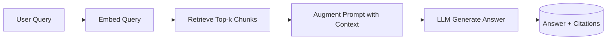
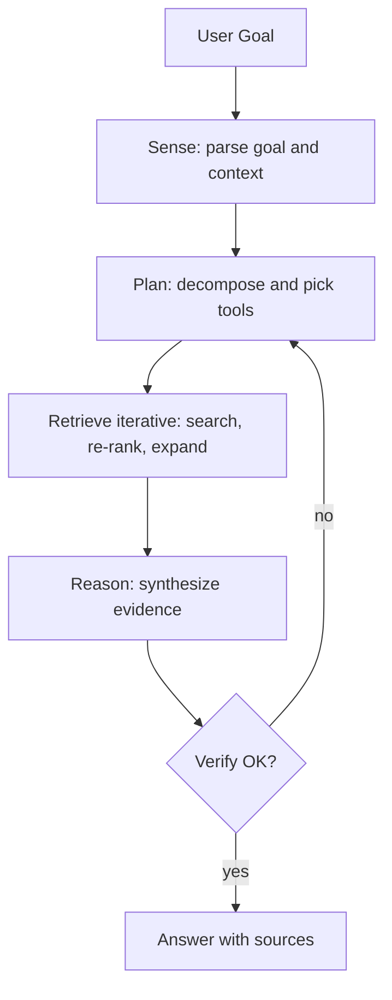

# Day 12 Notes — Agentic RAG: From Retrieval to Reasoning Loops

What Is RAG
--------------------------------------------------

**Retrieval‑Augmented Generation (RAG)** augments an LLM with external knowledge at inference time.

Typical pipeline:
1. Embed and index documents in a vector store
2. At query time, retrieve top‑k relevant chunks
3. Provide retrieved context to the LLM to generate an answer

Strengths:
- Grounds answers in source text and reduces hallucinations
- Keeps knowledge fresh without model retraining
- Straightforward to implement end‑to‑end

Limitations:
- One‑shot retrieval can miss needed context (recall/coverage)
- No decomposition for multi‑hop or complex tasks
- Limited self‑checking or verification
- Fixed prompt and static retrieval hyperparameters

Classic RAG Flow (Overview)
--------------------------------------------------

Why Agentic RAG
--------------------------------------------------

As questions become more complex, a single retrieve→generate step is brittle. You need a loop that can plan, act, observe, and revise—deciding when more evidence is required.

Agentic RAG introduces an **agent loop** around RAG that can:
- Decompose questions into sub‑tasks (planning)
- Reformulate queries and run iterative retrieval
- Use complementary tools (search, re‑rankers, web APIs, calculators, code runners)
- Verify claims via self‑consistency or retrieve‑to‑verify passes
- Decide when to stop based on confidence and guardrails

RAG vs Agentic RAG
--------------------------------------------------

- **Simplicity vs Capability**: RAG is simpler/faster; Agentic RAG handles harder, multi‑hop queries
- **Determinism vs Adaptivity**: RAG uses fixed k/prompt; Agentic RAG adapts strategy per query
- **Latency/Cost**: Agentic loops add steps (planning, verification), increasing cost and latency
- **Governance**: Agentic loops require guardrails (max steps, verification gates, tool access control)

Agentic RAG Loop (Sense → Plan → Retrieve → Reason → Verify → Answer)
--------------------------------------------------

How They Fit Together
--------------------------------------------------

- **RAG** is a solid baseline for single‑turn, fact‑seeking tasks with clear scope and good chunking.
- **Agentic RAG** wraps RAG with decision‑making that can reformulate queries, chain retrieval steps, invoke tools, and verify outputs before answering.
- Many systems start with RAG, then add agentic behaviors selectively where they measurably improve quality (e.g., query decomposition, re‑ranking, citation checks).

Concrete Example: Evolving a Baseline Into Agentic RAG
--------------------------------------------------

Start with baseline RAG:
- Implement `retrieve(k) → prompt(LLM) → answer`
- Log retrievals, prompts, answers

Add quality boosters:
- Re‑ranking to improve top‑k
- Query reformulation (synonyms, entities)
- Citations linking claims to chunks

Upgrade to agentic behaviors:
- Planning for multi‑hop questions → sub‑queries
- Iterative retrieval with stop conditions (confidence, step cap)
- Verification pass (retrieve‑to‑verify or dual‑answer consensus)
- Tool use: web/doc search, calculator, code runner for quantitative checks

What the Agentic Loop Defines
--------------------------------------------------

- **Activation conditions**: when to switch from one‑shot to agentic mode (e.g., low confidence, multi‑entity queries)
- **Processing steps**: sense → plan → retrieve (iterative) → reason → verify → answer
- **Output contract**: grounded answer with citations; optional step trace
- **Quality constraints**: coverage thresholds, verification gates, step caps, timeouts

Key Takeaways
--------------------------------------------------

- RAG provides grounded answers via retrieval; it’s fast and simple
- Agentic RAG adds planning, iteration, tools, and verification for complex tasks
- Expect higher latency/cost; add observability and guardrails early
- Evolve incrementally: baseline → boosters → targeted agentic upgrades

Reflection Questions
--------------------------------------------------

- Where does your current RAG pipeline fail—recall, multi‑hop reasoning, or verification?
- Which agentic behaviors would most improve quality on your data?
- What guardrails (max steps, confidence gates) will you enforce?
- How will you measure ROI: accuracy vs latency vs cost?

Appendix: Minimal Prompts
--------------------------------------------------

- Baseline RAG answer prompt (sketch):
  - "Using only the provided context, answer the question. Cite chunk IDs. If unsure, say you don’t know."
- Agentic planning prompt (sketch):
  - "Decompose the user goal into sub‑queries. For each, propose retrieval terms and tools. Stop after N steps."
- Verification prompt (sketch):
  - "Given the draft answer, retrieve to verify each claim. Mark claims as supported, contradicted, or unknown; update citations."
