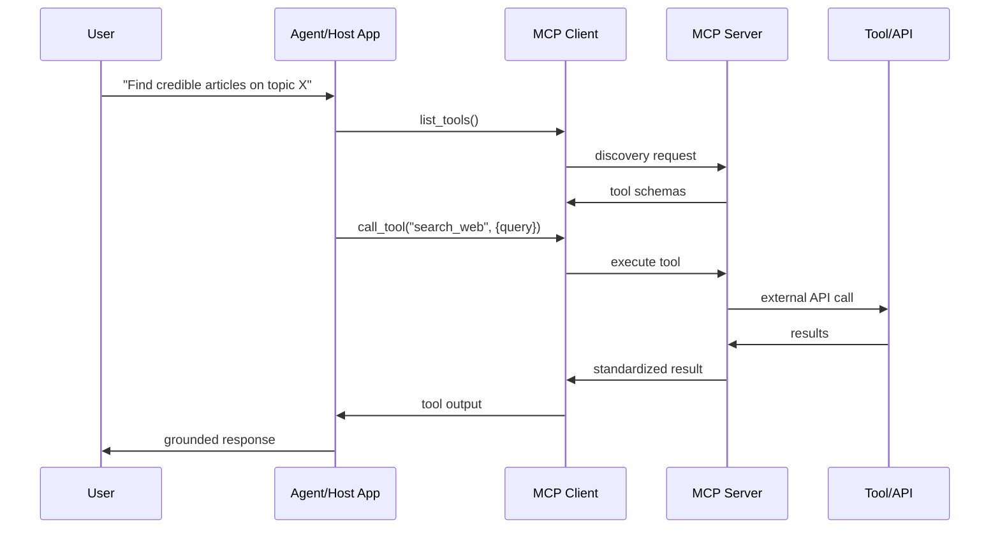
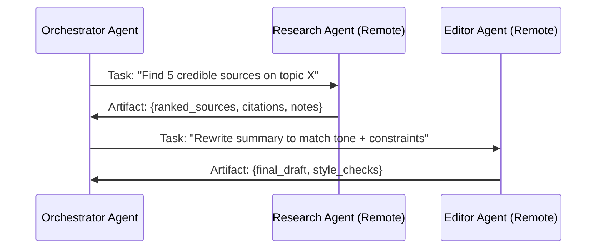
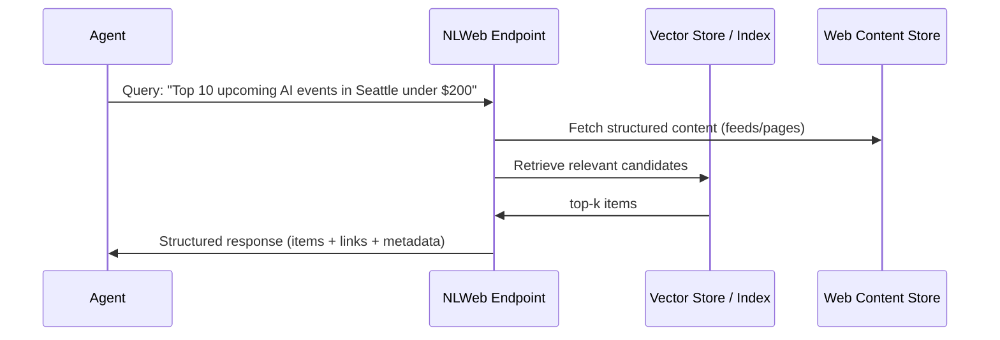

# Day 14 Notes: Agentic Protocols (MCP, A2A, NLWeb)

## 1. Summary of Core Concepts

### A. Why “Agentic Protocols” Matter

As agent systems mature, the hard part is less about prompting and more about **interoperability**:
- How an agent connects to **tools and data**
- How agents coordinate with **other agents**
- How websites expose content in a way that agents can query safely and consistently

This lesson focuses on three protocols that target those integration points:
- **MCP** (Model Context Protocol): Agent ↔ Tools/Data
- **A2A** (Agent-to-Agent): Agent ↔ Agent
- **NLWeb** (Natural Language Web): Website Content ↔ Natural Language Interface (often also Agent-accessible)

---

### B. What is MCP (Model Context Protocol)?

**MCP** standardizes how an AI application securely discovers and calls external **tools/resources** through a consistent interface.

**Key idea:** MCP makes “tool access” portable across apps, models, and environments.

#### MCP Core Components (Conceptual)
1. **Client** (in the host app / agent runtime)
   - Discovers tools
   - Sends tool invocations
   - Parses structured responses

2. **Server** (tool provider)
   - Exposes tool schemas + metadata
   - Executes tool logic
   - Returns standardized outputs/errors

3. **Transport**
   - Local (e.g., stdio) or remote (e.g., HTTP)

---

### C. What is A2A (Agent-to-Agent)?

**A2A** standardizes how one agent delegates work to another agent, often across teams, vendors, or services.

**Key idea:** Unlike “tool calls,” an A2A target is typically an **autonomous specialist** (a black box) that can do multi-step work and return an **artifact** (a work product).

#### A2A Core Concepts (Practical)
- **Agent Card**: “business card” describing capabilities and endpoints
- **Task**: a unit of work submitted to an agent
- **Artifact**: the output (document, structured result, analysis bundle)
- **Events/Status**: supports long-running jobs and progress reporting

---

### D. What is NLWeb (Natural Language Web)?

**NLWeb** is an approach/protocol for making a website’s content accessible via a **natural-language interface**, typically grounded in the site’s structured data and/or embeddings + retrieval.

**Key idea:** NLWeb turns a site into an “AI surface area” that users and agents can query.

A useful mental model:
- NLWeb = “NL search/Q&A endpoint for a site”
- Often implemented with:
  - content ingestion (Schema.org/RSS/pages)
  - embeddings + vector store (for retrieval)
  - grounded response generation
  - structured JSON responses (for agent consumption)

---

## 2. MCP vs. A2A vs. NLWeb: A Comparison

| Dimension | MCP | A2A | NLWeb |
|---|---|---|---|
| Connects | Agent ↔ Tools/Data | Agent ↔ Agent | Website ↔ Natural Language |
| Best when | You need many tools/services | You delegate to autonomous specialists | You publish a site/content to be NL-queryable |
| Output style | Tool result (structured) | Artifact (work product) | Grounded answers + structured items |
| Discovery | Tool schemas from server | Capability metadata (Agent Card) | Site exposes NL endpoint + response schema |
| Typical use | Search, DB, ticketing, repo access | Research agent, editor agent, finance agent | Docs site Q&A, event listing NL search |

---

## 3. Architecture Deep Dive

### A. “Layer Cake” Mental Model

```
┌─────────────────────────────────────────────┐
│ Collaboration Layer: A2A (Agent ↔ Agent)    │
│  - delegate tasks, return artifacts         │
└─────────────────────────────────────────────┘
┌─────────────────────────────────────────────┐
│ Tool/Execution Layer: MCP (Agent ↔ Tools)   │
│  - discover tools, call tools safely        │
└─────────────────────────────────────────────┘
┌─────────────────────────────────────────────┐
│ Content Layer: NLWeb (Web ↔ NL Interface)   │
│  - publish site content for NL querying     │
└─────────────────────────────────────────────┘
```

**Interpretation**
- MCP solves “how the agent uses external capabilities.”
- A2A solves “how agents collaborate as peers.”
- NLWeb solves “how a site exposes content in an agent-friendly way.”
- In real systems, these often **compose**.

---

### B. Workflow Graphs

#### 1) MCP Flow (Agent calls a tool)



#### 2) A2A Flow (Agent delegates to another agent)



#### 3) NLWeb Flow (Agent queries a website’s NL endpoint)



---

## 4. When to Use What?

### Decision Matrix

| Need | Choose | Why |
|---|---|---|
| Call external services/tools (search, DB, repo, ticketing) | **MCP** | Standard tool discovery + structured calls |
| Delegate to a specialist that does multi-step work | **A2A** | Treats remote system as an autonomous agent returning artifacts |
| Make your site/content queryable via natural language | **NLWeb** | Publish a grounded NL interface to your content |

### Simple Rule of Thumb
- If it behaves like a deterministic capability with clear inputs/outputs → **MCP (tool)**
- If it behaves like a collaborator that plans/executes and returns a work product → **A2A (agent)**
- If the “thing” is primarily content you own and want searchable/Q&A over → **NLWeb**

---

## 5. Practical Comparison Example (One Scenario, Three Protocol Views)

### Scenario: Newsletter Agent (End-to-End)

Goal: “Produce a weekly newsletter on Topic X with credible sources and clean writing.”

#### A. MCP View: Tools the agent calls

Example tool set:
- `search_web_fresh(query) -> [{title, url, snippet, published_at}]`
- `fetch_url(url) -> {text, title, author, published_at}`
- `extract_key_points(text) -> [{point, evidence_quote}]`
- `save_draft(content) -> {draft_id}`

**What’s nice here**
- Adding a tool is a server-side change (ideally) rather than editing every client.
- Tool outputs are structured, making ranking, dedupe, and evaluation easier.

#### B. A2A View: Delegate to specialist agents

Example agent roles:
- **Research Agent**: returns a ranked list + citations + credibility notes
- **Editor Agent**: enforces style + consistency + constraints (length, tone)

Example artifacts:
- Research Artifact:
  - `ranked_items[]`
  - `citations[]`
  - `why_it_matters` bullets
- Editor Artifact:
  - `final_draft`
  - `style_checks` (e.g., “no hype language”, “<= 150 words per item”)

**What’s nice here**
- Each specialist is independently evolvable.
- The orchestrator can swap vendors/teams without rewriting internal logic.

#### C. NLWeb View: High-quality content sources

Instead of scraping arbitrary pages, the agent queries NLWeb-enabled sources:
- “Query the events site for upcoming events”
- “Query the docs site for latest release notes”
- “Query a publisher’s archive for topic coverage”

**What’s nice here**
- More grounded, structured, and publisher-intended access patterns.
- Often cleaner metadata (dates, categories, canonical URLs).

---

## 6. Implementation Patterns (Practical, Not Over-Engineered)

### A. Minimal MCP Adoption Pattern
- Start with a small set of tools with clean schemas.
- Add:
  - input validation
  - structured errors (never crash the agent run)
  - rate limiting + timeouts
  - basic observability (latency_ms, error_count)

### B. Minimal A2A Adoption Pattern
- Create two agents:
  - Orchestrator (planner)
  - Specialist (doer)
- Define:
  - Agent Card (capability + endpoint)
  - Task schema (what the orchestrator sends)
  - Artifact schema (what the specialist returns)

### C. Minimal NLWeb Adoption Pattern
- Pick one content domain (docs, events, catalog).
- Define:
  - ingestion sources (RSS/pages/structured JSON)
  - indexing strategy (embeddings + metadata)
  - response shape (items + links + supporting fields)

---

## 7. Best Practices

### A. Security & Trust Boundaries
- Treat all tool outputs and web content as **untrusted** by default:
  - validate URLs/domains
  - sanitize HTML/text
  - protect against prompt injection in retrieved content
- For A2A, treat remote agents as **untrusted peers**:
  - enforce allowed capabilities and output schemas
  - log + audit delegated tasks

### B. Reliability
- Prefer structured results everywhere:
  - MCP tool outputs
  - A2A artifacts
  - NLWeb responses
- Implement timeouts and partial success:
  - “items + errors” is better than a hard failure

### C. Observability (Non-negotiable for production)
- Trace:
  - tool calls (name, latency, error)
  - agent-to-agent tasks (task id, status)
  - retrieval queries (top-k, sources, coverage)

---

## 8. Workflow Diagrams (Readable, Shareable)

### A. “Compose All Three” Architecture

```
User
  ↓
Orchestrator Agent
  ├─(A2A)→ Research Agent → returns Artifact (ranked sources + citations)
  ├─(A2A)→ Editor Agent   → returns Artifact (final draft + checks)
  ├─(MCP)→ Tools: search/fetch/store/log
  └─(NLWeb)→ Query publisher/site endpoints for grounded content
  ↓
Newsletter Output
```

---

## 9. Key Takeaways

1. **MCP** standardizes **tool access** (agent ↔ tools/data).
2. **A2A** standardizes **agent collaboration** (agent ↔ agent, artifacts as outputs).
3. **NLWeb** standardizes **natural-language access to websites/content**.
4. They are **complementary** and often stronger together than alone.
5. Use the simplest protocol that matches the boundary:
   - Tool boundary → MCP
   - Autonomous collaborator boundary → A2A
   - Website/content publishing boundary → NLWeb

---
## 9. Additional resources
1. A2A中文站： https://a2acn.com
2. MCP中文站： https://mcpcn.com