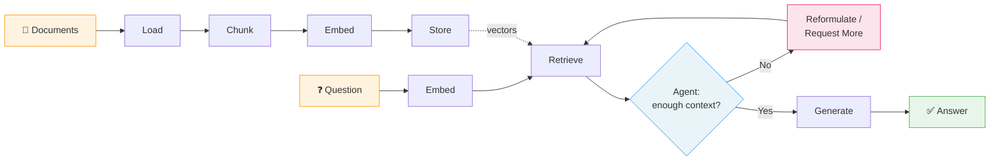

# Day 15 Notes: Building Your First RAG System (From Scratch)

## 1. Summary of Core Concepts

### A. What is RAG and Why It Matters

**RAG** (Retrieval-Augmented Generation) fixes the fundamental limitation of LLMs: they don't know about **your** data. Instead of hoping the LLM has seen your documents during training (it hasn't), RAG:

1. **Retrieves** relevant chunks from your own documents
2. **Augments** the LLM prompt with that context
3. **Generates** an answer grounded in your actual data

Without RAG, the LLM either says "I don't know" or **hallucinate** — confidently making up an answer. With RAG, every answer is traceable back to source documents.

---

### B. The RAG Pipeline (6 Stages)

The rag-from-scratch repo implements each stage from raw Python — no LangChain, no vector DB libraries, no OpenAI SDK.

| Stage           | Module                | Purpose                                                                       |
| --------------- | --------------------- | ----------------------------------------------------------------------------- |
| **1. Load**     | `rag/loader.py`       | Read documents (PDF, Markdown, web pages) → normalize to plain text           |
| **2. Chunk**    | `rag/chunker.py`      | Split text into overlapping pieces (~500 chars) so each chunk fits in context |
| **3. Embed**    | `rag/embedder.py`     | Convert each chunk → 3072-dimension vector via Azure AI Foundry API           |
| **4. Store**    | `rag/vector_store.py` | Save vectors + metadata to disk; support cosine similarity search             |
| **5. Retrieve** | `rag/retriever.py`    | Embed user query → find top-k most similar chunks                             |
| **6. Generate** | `rag/generator.py`    | Build prompt with retrieved context → stream LLM answer with source citations |

#### RAG Pipeline Diagram



---

### C. Key Concepts

#### Embeddings

- A **vector** (list of numbers) that captures the **meaning** of text
- Similar texts → similar vectors; unrelated texts → distant vectors
- Model used: `text-embedding-3-large` (3072 dimensions) via Azure AI Foundry

#### Cosine Similarity

- Measures the **angle** between two vectors (not distance)
- Range: -1.0 (opposite) → 0.0 (unrelated) → 1.0 (identical)
- Preferred over Euclidean distance because it's magnitude-invariant (a short paragraph and a long essay about the same topic still match)

#### Chunking

- **Why**: stuffing entire docs is expensive, noisy, and less accurate
- **Overlap**: prevents cutting sentences in half across chunk boundaries
- **3 strategies**: fixed-size, fixed-size with overlap, sentence-based (smartest)

#### Prompt Construction

```
System: "Answer ONLY from the provided context. Cite sources. Say 'I don't know' if context doesn't help."
User: "Context:\n{chunks}\n\nQuestion: {query}"
```

- Temperature set to 0.3 (low) for factual, deterministic answers

---

### D. Advanced Retrieval

#### Hybrid Search (BM25 + Vector)

- **Vector search** excels at semantic similarity but can miss exact keyword matches
- **BM25** (keyword search) finds exact terms but misses synonyms/paraphrases
- **Hybrid** combines both using **Reciprocal Rank Fusion (RRF)** — ranks, not raw scores, are merged

#### Reranking (Two-Stage Retrieval)

- Stage 1: Fast retrieval of top-20 candidates (1 embedding call)
- Stage 2: LLM reads each (query, chunk) pair together and scores 0-10 (20 LLM calls)
- Keeps top-5 highest-scoring chunks → much more precise but ~10× slower

#### Agentic RAG (ReAct Pattern)

- Wraps retrieval in a **Thought → Action → Observation** loop (max 5 iterations)
- 3 actions: `RequestMoreContext`, `ReformulateQuery`, `Answer`
- Self-correcting: if initial search misses, the agent reformulates and tries again
- Best for complex/ambiguous questions where single-pass retrieval is unreliable

---

### E. Evaluation Framework

Three metrics that test different parts of the pipeline:

| Metric                  | Question it answers                                   | What to fix if low                  |
| ----------------------- | ----------------------------------------------------- | ----------------------------------- |
| **Retrieval Precision** | Did we find the right chunks?                         | Tune chunk_size, overlap, threshold |
| **Answer Faithfulness** | Is the answer grounded in context (no hallucination)? | Strengthen system prompt            |
| **Answer Relevance**    | Does the answer address the question?                 | Improve retrieval + prompt          |

Uses **LLM-as-Judge** — the same LLM scores answers on a 0.0–1.0 scale (industry standard, used by RAGAS, DeepEval).

---

## 2. Activity Notes

### Activity 1: End-to-end setup

<!-- Document your setup experience, any issues, and the output of your first query -->

### Activity 2: Pipeline trace

<!-- Fill in your version of the pipeline table with personal observations -->

### Activity 3: Search mode comparison

<!-- Paste your comparison table showing chunks/scores/answers across vector, keyword, hybrid, hybrid+rerank -->

### Activity 4: Evaluation results

<!-- Paste eval output and note your key insight about which mode works best for your data -->

### Activity 5: Agentic RAG trace

<!-- Paste the agent's Thought/Action/Observation trace and annotate when it reformulated and why -->

---

## 3. Key Takeaways

- [ ] RAG grounds LLM answers in your own documents — no fine-tuning needed
- [ ] The pipeline is modular: load → chunk → embed → store → retrieve → generate
- [ ] Cosine similarity on embeddings enables semantic search (meaning, not just keywords)
- [ ] Hybrid search (vector + BM25) + reranking gives the best accuracy at higher cost
- [ ] Agentic RAG (ReAct) makes retrieval self-correcting for complex questions
- [ ] Evaluation (precision, faithfulness, relevance) turns RAG tuning from guessing to data-driven

---

## 4. Questions / Follow-ups

<!-- Note any questions that came up during study for further research -->
